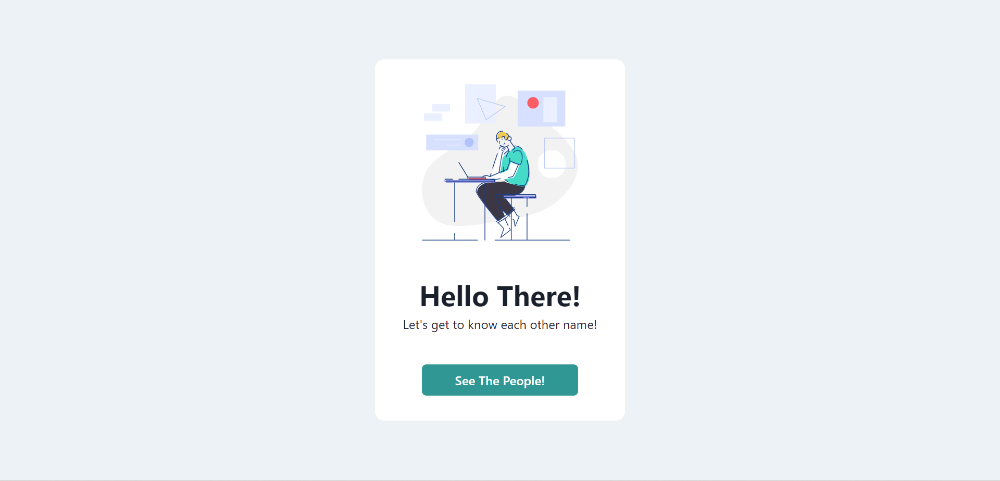

# SWAPI-API Project

This is a solution to the SWAPI-API for react web app.

## Table of contents

- [Overview](#overview)
  - [Screenshot](#screenshot)
  - [Links](#links)
- [My process](#my-process)
  - [Built with](#built-with)

## Overview

### Screenshot

### Links

- Live Site URL: [Link](https://andrewfpai.github.io/ekskul-swapi/)

## My process

### Built with

- React TypeScript
- React Router
- Chakra UI
